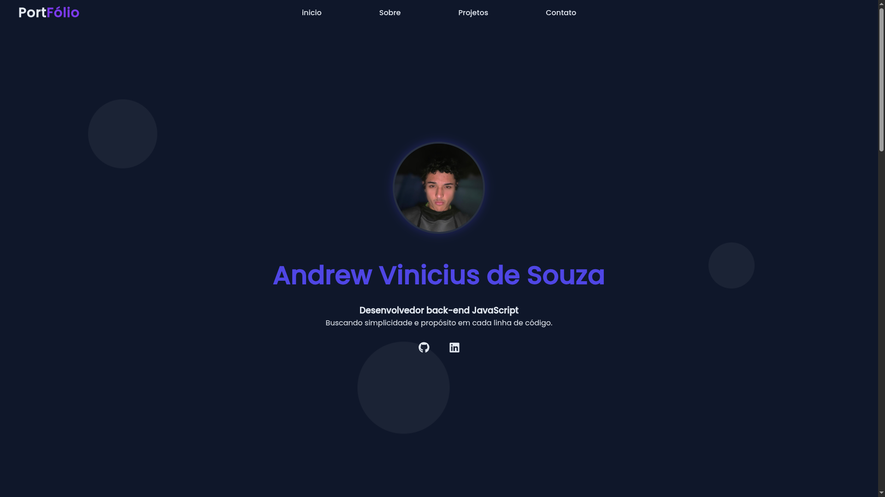

# Portfólio - Andrew Vinicius de Souza

Meu nome é **Andrew Vinicius de Souza**, sou um desenvolvedor back-end JavaScript com Node.JS + express e também em C# com APS.NET apaixonado por
tecnologia e codigos! Esse projeto é um espaço
reservado para para mostrar alguns dos meus projetos
e falar mais sobre minhas habilidades como desenvolvedor.

---

## 🌐 Visualizar Portfólio

Clique na imagem abaixo para acessar o portfólio online:

---

## 🖥️ Tecnologias Utilizadas

- HTML5
- CSS3
- JavaScript
- Font Awesome (ícones)

---

## 📌 Funcionalidades

- **Seção Home:** Apresenta foto, nome, descrição e links para GitHub e LinkedIn.
- **Seção Sobre:** Informações sobre o desenvolvedor e suas habilidades.
- **Seção Projetos:** Mostra projetos desenvolvidos.
- **Seção Contato:** Formulário de contato funcional.
- **Responsividade:** O site se adapta a diferentes tamanhos de tela.

---

## 🔗 Links

- GitHub: [GitHub](https://github.com/andrewSouza-dev)
- LinkedIn: [LinkedIn](https://www.linkedin.com/in/devandrew)

---

## 📝 Observações

Os scripts JavaScript adicionam interatividade, como envio de mensagens e efeitos visuais.

Os estilos CSS garantem um layout moderno e responsivo.

Este projeto pode ser expandido com mais projetos, animações e integração com APIs.

---

## 🖋️ Autor

Andrew Vinicius de Souza
Desenvolvedor back-end JavaScript(NodeJs) / C#(ASP.NET)
